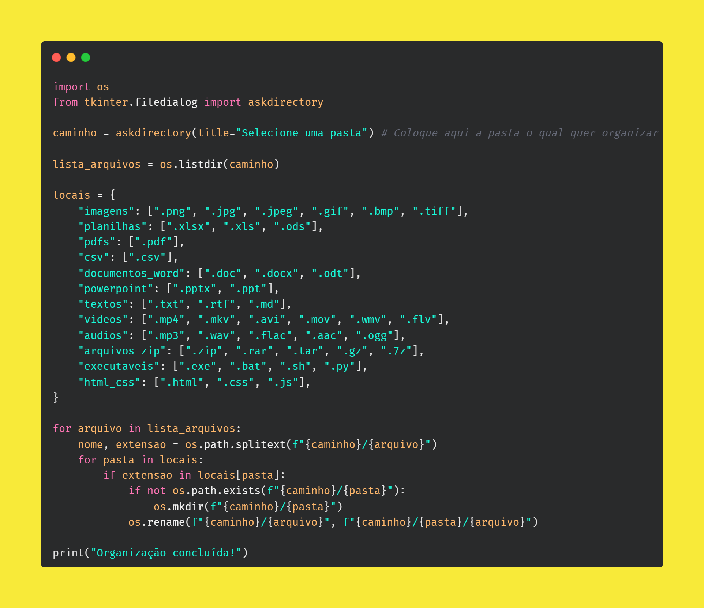

# Organizador de Arquivos em Python

## Programa de Automação

# Descrição do Programa:
Este programa foi desenvolvido em Python com o intuito de automatizar a organização de qualquer pasta no seu computador. Ele categoriza e move arquivos para pastas específicas, com base na extensão dos arquivos. A interface gráfica utiliza a biblioteca tkinter para permitir ao usuário selecionar a pasta que deseja organizar. 

# Funcionamento:
Seleção da Pasta: O programa abre uma janela para o usuário selecionar a pasta que deseja organizar.
Leitura dos Arquivos: Todos os arquivos na pasta selecionada são listados.
Classificação: Os arquivos são classificados de acordo com suas extensões em categorias predefinidas (como imagens, planilhas, PDFs, etc.).
Organização: Os arquivos são movidos para pastas específicas dentro da pasta selecionada, criando essas pastas caso não existam.

### Categorias e Extensões:
- **Imagens**: `.png`, `.jpg`
- **Planilhas**: `.xlsx`, `.xls`
- **PDFs**: `.pdf`
- **CSV**: `.csv`
- **Documentos Word**: `.css`, `.doc`, `.docx`
- **Apresentações PowerPoint**: `.pptx`

Este programa é ideal para manter suas pastas organizadas de forma automática, poupando tempo e esforço.

